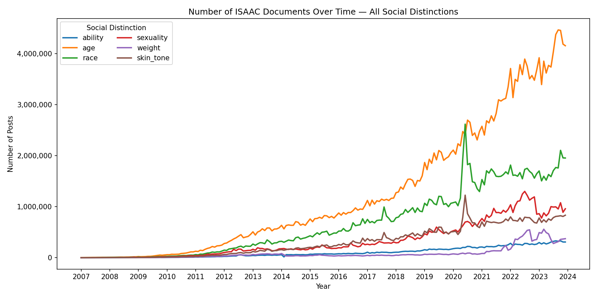

# Illinois Social Attitudes Aggregate Corpus (ISAAC)

This repository contains tools for the development and evaluation of the **Illinois Social Attitudes Aggregate Corpus (ISAAC)**, a comprehensive dataset of Reddit discourse from 2007 to 2023 about social groups defined by distinctions based on sexuality, race, age, ability, weight and skin-tone (**total size: 554,464,184 posts**). Submissions and comments in ISAAC are being labeled using the scripts in this folder for **a variety of social-psychological variables** of interest, including moralization, sentiment, generalizations and emotions. 




## Corpus Access

You can read about the list of variables included in the corpus and their definitions [here](https://github.com/BabakHemmatian/Illinois_Social_Attitudes/blob/main/variable_list.md). The relevance-filtered data can be found [here](https://drive.google.com/drive/u/0/folders/15luTEiHnt8BnnHjYmQnS__DSUt3lODjr). We are currently in the process of adding the social-psychological variables to the uploaded version of the corpus, but users can find plug-and-play scripts in this repository for extracting them themselves. 

## The Current Repository

This repository contains the scripts that allow you to rebuild ISAAC from scratch by:
- Filtering Reddit content by keywords and the use of English language. 
- Applying pre-trained neural networks and complex pattern matching to prune irrelevant content picked up by keywords (e.g., "Black" in a context other than race). 
- Generating generalized language (e.g., genericity), moralization, sentiment and emotion labels for the pruned corpus.

The scripts were designed to be easily adapted for developing other Reddit corpora. See the **Adaptations** section below for more information.

**Note:**
- The scripts were developed on Windows 11, then tested on Ubuntu. However, cross-platform compatibility is not guaranteed.
- The ```label_localization``` resource, identifying the country and the state where a user likely resides, is in development.

## Citation
If you use this repository in your work, please cite us as follows:

### APA Format
```
Hemmatian, B., Hadjarab, S., Yu, R. (2025). The Illinois Social Attitudes Aggregate Corpus [Computer software]. GitHub. [https://github.com/BabakHemmatian/Illinois_Social_Attitudes](https://github.com/BabakHemmatian/Illinois_Social_Attitudes)
```
### BibTex Format
```
**BibTex: **
@misc{Hemmatian2025,
  author       = {Hemmatian, Babak and Hadjarab, Sarah and Yu, Rui},
  title        = {Illinois_Social_Attitudes},
  year         = {2025},
  publisher    = {GitHub},
  journal      = {GitHub repository},
  howpublished = {\url{[https://github.com/yourusername/your-repository](https://github.com/BabakHemmatian/Illinois_Social_Attitudes)}},
}
```
## How To Use

### Repository Setup
Install [Git](https://git-scm.com/book/en/v2/Getting-Started-Installing-Git) on your computer. When finished, open a command line terminal, navigate to where you would like to place the repository, then enter ```git clone https://github.com/BabakHemmatian/Illinois_Social_Attitudes.git```. Note that the raw and processed data files for the full 2007-2023 take several terabytes of space. Choose the repository location according to your use case's storage needs.

Download [this folder](https://drive.google.com/drive/folders/1TqxjRRMZ3LTGWRCMkK6_tnIo_Zg1vms1?usp=sharing) into the newly created ```Illinois_Social_Attitudes``` folder.

The raw Reddit data that the ```filter_keywords``` resource requires can be found and downloaded [here](https://academictorrents.com/details/ba051999301b109eab37d16f027b3f49ade2de13). The functions currently assume Reddit Comments as the type of data, with the relevant .zst files for a given timeframe to be placed in ```data/data_reddit_raw/reddit_comments/```. 

### Virtual Environment Setup
Follow the steps [here](https://docs.conda.io/projects/conda/en/latest/user-guide/install/index.html) to install the desired version of Anaconda. 

Once finished, navigate to ```Illinois_Social_attitudes``` on the command line and enter ```conda create --name ISAAC python=3.12 pip```. Answer 'y' to the question. When finished, run ```conda activate ISAAC```. Once the environment is activated, run the following command to install the necessary packages: ```pip install -r req.txt```. 

### Commands
You can now use command line arguments to make use of the resources. Use ```--help``` to receive more information about the available options. 

**Example:**
```
python ./code/cli.py --resource filter_keywords --group sexuality --years 2007-2009
```
This example command will use the appropriate keyword lists from this repository to identify documents in the complete Pushshift dataset that are potentially related to sexuality, and which come from 2007-2009. 

**Note:** The scripts may be used without any changes to recreate the ISAAC corpus. For that purpose, the code base currently assumes the following order in the use of resources for a given social group and year range:

1. ```filter_keywords```: Uses an extremely fast algorithm to parse trillions of Reddit posts for large sets of keywords that suggest potential relevance to ISAAC's key social distinctions. 
2. ```filter_language```: Uses a pre-trained language detection model from FastText to filter out non-English posts. 
3. ```filter_relevance```: Uses a set of custom transformer-based neural networks to filter out irrelevant content picked up by the keyword method. 
4. ```filter_keywords_adv```: Uses highly-optimized complex pattern matching to remove irrelevant content not filtered by steps (1) and (3). 
5. _```label_moralization```_: Generates binary labels for whether a post's content is moralized using a custom neural network trained on [this](https://arxiv.org/pdf/2208.05545) dataset.
6. _```label_sentiment```_: Generates a range of sentiment labels for a post based on [Stanza](https://stanfordnlp.github.io/stanza/sentiment.html), [TextBlob](https://textblob.readthedocs.io/en/dev/quickstart.html) and [Vader](https://github.com/cjhutto/vaderSentiment) models. The combination of multiple models supports reliable inference.
7. _```label_generalization```_: Generates clause-by-clause labels for the linguistic features that determine the degree of generalization in each statement within a post. 
8. _```label_emotion```_: Generates a range of emotion labels for a post based on the neural network models found [here](https://huggingface.co/j-hartmann/emotion-english-distilroberta-base), [here](https://huggingface.co/sickboi25/emotion-detector) and [here](https://huggingface.co/tae898/emoberta-base).

**Note:** _italicized_ resources are LLM-based and require the batch size argument (```-batchsize [integer]``` or ```-b [integer]```). Set it based on your RAM and GPU RAM capacity. Values between 1200 and 2500 were used during the development of ISAAC. 

**Note**: LLM-based resources would become much faster with Cuda-enabled GPU acceleration (available on Nvidia graphics cards, with a corresponding tool for Mac users). If you plan to use this feature, follow the steps [here](https://medium.com/@harunijaz/a-step-by-step-guide-to-installing-cuda-with-pytorch-in-conda-on-windows-verifying-via-console-9ba4cd5ccbef) to install PyTorch with Cuda support within your new conda environment. You can speed up processing even further by using batch processing in a computing cluster by adding the ```--slurm``` or ```-s``` flag to your command. Note that the specific sbatch arguments in ```slurm.sh``` need to be adjusted based on the particular cluster you are using. 

If you plan instead to adapt the code for developing new datasets, see the section below. 

## Adaptations

### Adjusting Social Groups and Related Keywords
The current list of social groups and their binary subgroups are found in ```scripts/utils.py```. 

To search the entirety of Reddit for posts potentially relevant to your dimension of interest beyond those listed, change the key-value pairs for the groups variable in ```utils.py``` and the choices for the corresponding ```--group``` argument in ```cli.py```. Then, add correctly formatted and named text files to the ```keywords``` folder that contain words helpful for identifying potentially relevant content for your use case. See the existing files for examples to follow. This code base uses ```pyahocorasick``` for extremely fast recognition of dozens of keywords in billions of posts. This package allows only alphanumeric and punctuation characters. Choose your keyword format accordingly. Note that the resource scripts can be easily adjusted to allow for different orders of resource use or the application of new classification models (see below). 

### Training New Relevance Classifiers
The ```filter_sample``` resource can be used to extract stratified samples from keyword- and language-filtered documents to be annotated for the training of new relevance classifiers. The script assumes two annotators and by default generates 1500 documents per rater equally distributed across the indicated years. 

Use the ```metrics_interrater``` resource with the correct ```--group``` argument to evaluate interrater agreement. No ```years``` argument is needed for this resource. Once sufficient interrater agreement is reached, use the ```train_relevance``` resource to train new relevance filtering neural networks. Adjust the social ```group``` argument to your target and change the training hyperparameters as needed. No ```years``` argument is required for this resource.

### Complex Pattern Matching
If there are still many irrelevant posts in your dataset, you might want to consider using complex regular expression patterns to filter them out. You can see examples of the sets created for ISAAC in the keywords folder, distinguished with ```_adv``` for "advanced" in the file names. Replace these sets with regular expressions that fit your use case and employ the ```filter_keywords_adv``` to use the patterns for rapidly filtering your dataset based on a parallelized version of the highly-optimized hyperscan engine. 

### Label Generation
If the social-psychological labels provided alongside ISAAC work well for your use case, you can apply ```label``` resources to generate them for your new corpus. 
